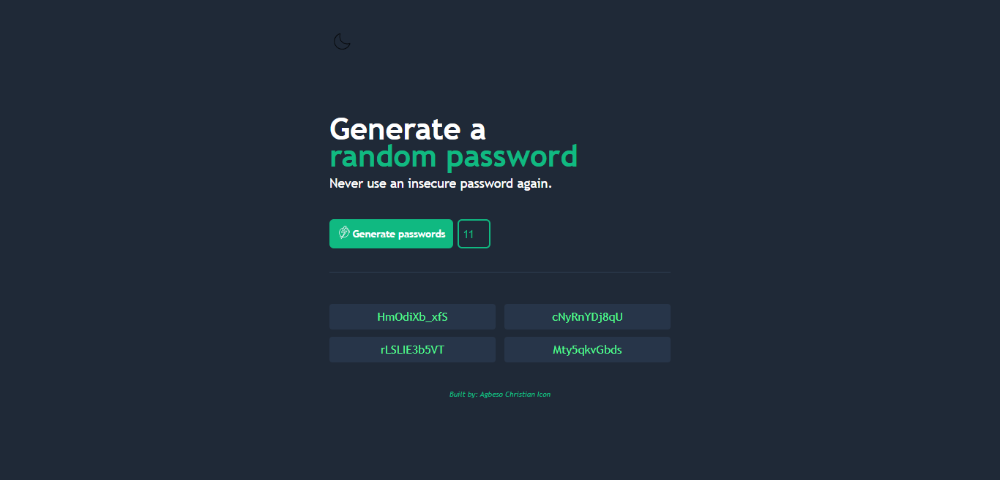

# Password Generator Web App
Never use an insecure password again. . .

## Description
The Password Generator Web App generates four secure random passwords for you with JUST A CLICK. . .And with one more extra click you copy your preffered password option to clipboard.

This App was built with JavaScript, HTML5, CSS3 and it is RESPONSIVE.

It give users the liberty to set a preferred password length, meanwhile given feedback to the user via an alert if their preffered password length is too short.

Users can switch between dark and light mode, hence given optima experience.

Live Server/Demo here: https://agbesochristian.github.io/Password-Generator-App/

## Key Learnings
SetTimeOut Method - This help to regulate when things execute. With this method, we can tell our code when to execute.

Math.floor() and Math.random() method - This methods enabled the App to generate random whole numbers for looping and selections.

Incorporating the Dark and Light Mode.

Incorporating the 1-click to copy feature - This feature enable users to click to copy their preffered password option to the clipboard which they can then save for future use.

Manipulating the DOM.

Responsive Layout - Mobile First
Media Query.

Discovered that multiple event listeners can be added to a single element - This enabled me to incorporate screentip/screenhint feature - A feature that I love so much(for only desktop users).

## Credit
This Project was inspired by Scrimba - One of the Solo projects in the Frontend Career Path.
